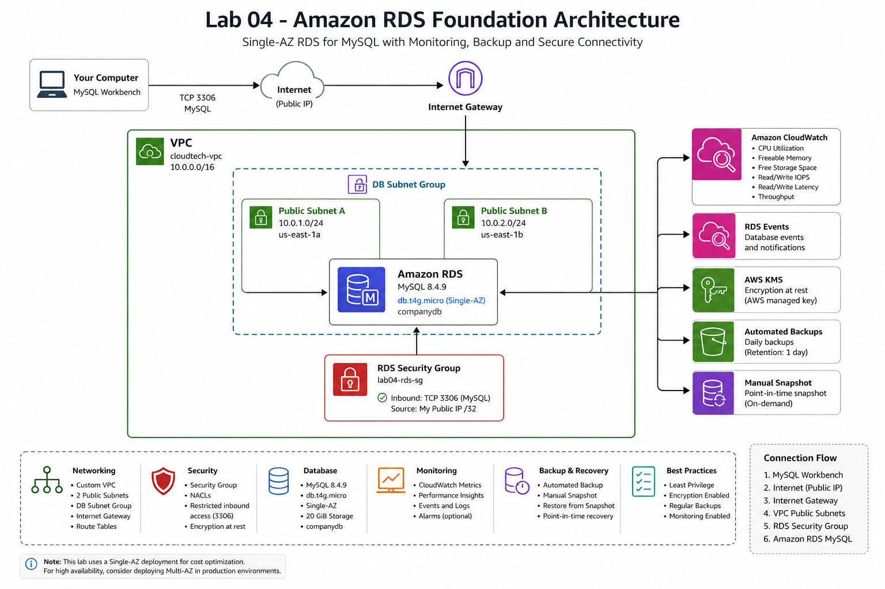

# 🗄️ Lab 04 - Amazon RDS Foundation

## 📖 Overview

This lab demonstrates the deployment and administration of an Amazon RDS for MySQL instance integrated with a custom Amazon VPC.

The objective was not only to create a relational database, but also to understand networking, security, monitoring, backups, snapshots, database connectivity, and basic SQL operations.

---

# 🎯 Objectives

- Deploy an Amazon RDS MySQL instance
- Reuse the custom VPC created in Lab 02
- Create a DB Subnet Group across multiple Availability Zones
- Configure a dedicated Security Group
- Enable storage encryption with AWS KMS
- Configure automated backups
- Connect remotely using MySQL Workbench
- Perform CRUD operations
- Monitor the database using Amazon CloudWatch
- Analyze RDS Events
- Create a manual Snapshot
- Understand Multi-AZ, Read Replicas and Snapshot Restore

---

# 🏗️ Architecture

> *(The architecture diagram will be added below after completing the documentation.)*



---

# ☁️ AWS Services Used

- Amazon RDS
- Amazon VPC
- Amazon CloudWatch
- AWS Key Management Service (KMS)
- Security Groups
- DB Subnet Groups
- Network ACLs

---

# 🌐 Network Configuration

The RDS instance was deployed inside the custom VPC created during the networking laboratory.

## VPC

| Property | Value |
|----------|-------|
| CIDR | 10.0.0.0/16 |

## Public Subnets

| Subnet | CIDR | Availability Zone |
|---------|------|-------------------|
| public-subnet-a | 10.0.1.0/24 | us-east-1a |
| public-subnet-b | 10.0.2.0/24 | us-east-1b |

A custom DB Subnet Group was created using both subnets.

---

# 🗄️ Database Configuration

| Configuration | Value |
|---------------|-------|
| Engine | MySQL Community |
| Version | 8.4.9 |
| Instance Class | db.t4g.micro |
| Deployment | Single-AZ |
| Storage | 20 GiB |
| Database | companydb |
| Port | 3306 |
| Encryption | Enabled |
| KMS Key | aws/rds |
| Automated Backup | Enabled |
| Backup Retention | 1 day |

---

# 🔐 Security

The RDS instance was configured with:

- Dedicated Security Group
- Restricted inbound rule (TCP 3306)
- Access limited to a specific public IP (/32)
- Encryption at rest enabled using AWS KMS

---

# 💻 Database Connection

The database was accessed remotely using MySQL Workbench.

Connection settings:

| Property | Value |
|----------|-------|
| Protocol | TCP/IP |
| Port | 3306 |
| Database | companydb |

Sensitive credentials are not included in this repository.

---

# 📝 SQL Operations

To validate the database connection, a sample **employees** table was created.

The following operations were successfully executed:

- CREATE TABLE
- INSERT
- SELECT
- WHERE
- UPDATE
- DELETE

Example:

```sql
CREATE TABLE employees (
    id INT AUTO_INCREMENT PRIMARY KEY,
    first_name VARCHAR(50),
    last_name VARCHAR(50),
    department VARCHAR(50),
    salary DECIMAL(10,2),
    hire_date DATE
);
```

---

# 📊 Monitoring

Amazon CloudWatch was used to monitor the RDS instance.

Metrics analyzed:

- CPU Utilization
- Freeable Memory
- Free Storage Space
- Read IOPS
- Write IOPS
- Read Latency
- Write Latency
- Throughput

---

# 📸 Evidence

The complete implementation screenshots are available inside the **evidencias/** folder.

| Screenshot |
|------------|
| 01-rds-instance-overview.png |
| 02-network-and-connectivity.png |
| 03-rds-crud-operations.png |
| 04-cloudwatch-metrics.png |
| 05-rds-events.png |
| 06-manual-snapshot.png |

---

# 🔎 Troubleshooting

During the lab, the database could not initially be reached from MySQL Workbench.

The following components were validated:

- Public Accessibility
- DNS Resolution
- Route Tables
- Internet Gateway
- Security Groups
- DB Subnet Group

The root cause was a custom Network ACL blocking inbound and outbound traffic.

After updating the Network ACL rules, connectivity to the RDS endpoint was successfully established.

This troubleshooting exercise provided practical experience with Amazon VPC networking and database connectivity.

---

# 💾 Backup & Recovery

Automated backups were enabled.

A manual Snapshot was created to demonstrate the recovery process.

The Snapshot can later be restored into a brand new RDS instance without affecting the original database.

---

# 📚 Concepts Reviewed

## Multi-AZ

Provides high availability by maintaining a synchronized standby instance in another Availability Zone.

## Read Replica

Provides additional read-only copies of the database to improve read scalability.

## Amazon Aurora

High-performance relational database compatible with MySQL and PostgreSQL.

## Amazon DynamoDB

Fully managed NoSQL database designed for high scalability and low latency.

---

# 🧹 Resource Cleanup

After completing the laboratory, all temporary resources were removed.

Deleted resources:

- Amazon RDS Instance
- DB Subnet Group
- RDS Security Group
- Manual Snapshot

The custom VPC was intentionally preserved for future laboratories.

---

# ✅ Status

**Completed ✔️**
