# ⚖️ Lab 06 - Application Load Balancer & Auto Scaling

## 📖 Overview

This lab demonstrates the deployment and management of a highly available web application infrastructure on AWS using an Application Load Balancer (ALB), Amazon EC2 Auto Scaling, and Apache web servers.

The objective was to understand how AWS distributes incoming traffic across multiple EC2 instances, monitors application health, maintains the desired number of instances, and replaces instances using updated Launch Template configurations.

The environment was deployed across two Availability Zones in the **US East (N. Virginia)** region.

---

## 🎯 Objectives

- Reuse the custom VPC created in Lab 02
- Configure dedicated Security Groups for the ALB and EC2 instances
- Create an EC2 Launch Template using Amazon Linux 2023
- Automate Apache installation and configuration using User Data
- Configure a Target Group with HTTP health checks
- Deploy an internet-facing Application Load Balancer
- Configure an HTTP listener on port 80
- Create an Auto Scaling Group across two Availability Zones
- Validate EC2 instance health and application connectivity
- Test HTTP requests through the ALB DNS endpoint
- Troubleshoot EC2 initialization issues
- Update the Launch Template and execute an Instance Refresh
- Validate successful replacement of EC2 instances

---

## 🏗️ Architecture

The following diagram illustrates the infrastructure implemented during this lab, including the custom VPC, public subnets, Application Load Balancer, Auto Scaling Group, and EC2 web servers.

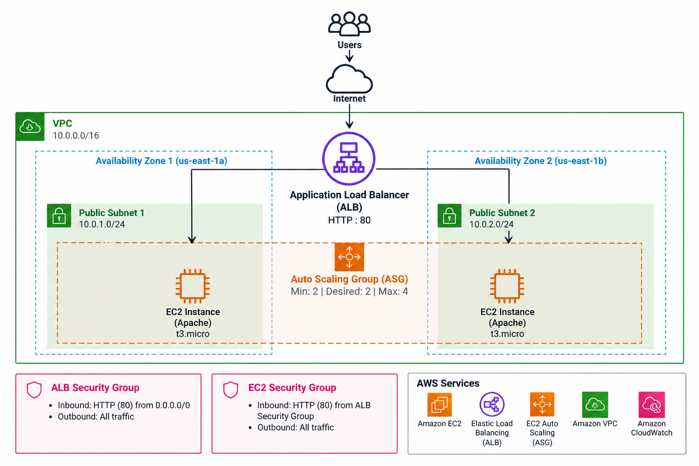

### Architecture Components

| Component | Configuration |
|---|---|
| AWS Region | us-east-1 (N. Virginia) |
| VPC | cloudtech-vpc |
| VPC CIDR | 10.0.0.0/16 |
| Availability Zones | us-east-1a and us-east-1b |
| Subnets | Two public subnets |
| EC2 Operating System | Amazon Linux 2023 |
| EC2 Instance Type | t3.micro |
| Web Server | Apache HTTP Server |
| Load Balancer | Application Load Balancer |
| Listener | HTTP - Port 80 |
| Target Group | HTTP - Port 80 |
| Auto Scaling Minimum | 2 instances |
| Auto Scaling Desired | 2 instances |
| Auto Scaling Maximum | 4 instances |

### Traffic Flow

1. Users access the application through the public ALB DNS endpoint.
2. The Application Load Balancer receives HTTP requests on port 80.
3. The ALB forwards requests to healthy targets registered in the Target Group.
4. EC2 instances running Apache respond to incoming requests.
5. The Auto Scaling Group manages the desired instance capacity across two Availability Zones.

---

## 🛠️ Implementation

### 1. Amazon VPC and Network Configuration

The infrastructure reused the custom VPC created in Lab 02.

The VPC contains public subnets distributed across two Availability Zones, allowing the Application Load Balancer and EC2 instances to operate in a multi-AZ environment.

**Configuration:**

- VPC: `cloudtech-vpc`
- CIDR: `10.0.0.0/16`
- Availability Zones: `us-east-1a` and `us-east-1b`
- Internet Gateway attached to the VPC
- Public routing configured for internet connectivity

**Evidence:**

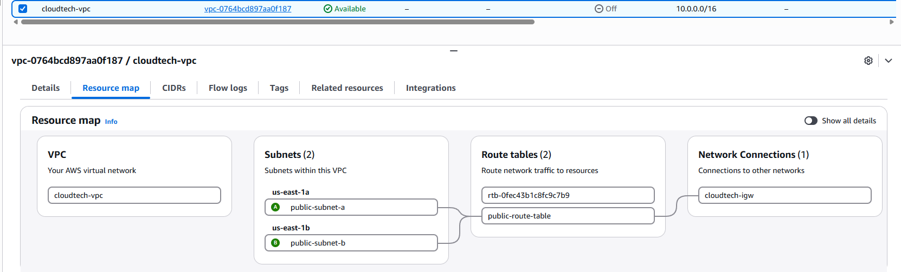

---

### 2. Application Load Balancer Security Group

A dedicated Security Group was created to allow incoming HTTP traffic to the Application Load Balancer.

**Security Group:** `lab06-alb-sg`

**Inbound rule:**

| Type | Protocol | Port | Source |
|---|---|---|---|
| HTTP | TCP | 80 | 0.0.0.0/0 |

This configuration allows users to access the web application through the public load balancer.

**Evidence:**

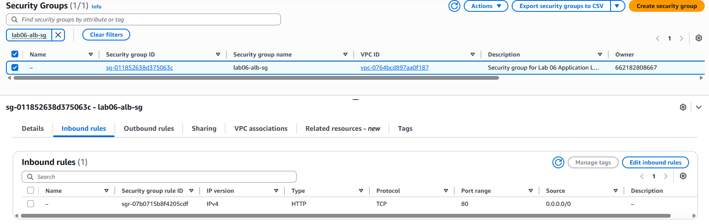

---

### 3. EC2 Security Group

A separate Security Group was created for the EC2 web servers.

**Security Group:** `lab06-ec2-sg`

**Inbound rule:**

| Type | Protocol | Port | Source |
|---|---|---|---|
| HTTP | TCP | 80 | ALB Security Group |

Instead of allowing HTTP access from the entire internet, the EC2 Security Group accepts application traffic only from the ALB Security Group.

This reduces direct exposure of the web servers.

**Evidence:**

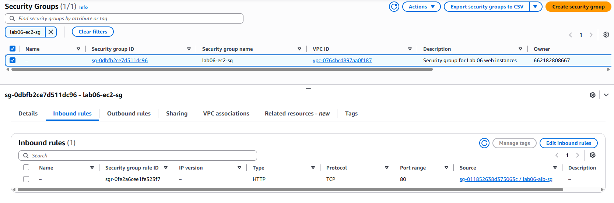

---

### 4. EC2 Launch Template

A Launch Template was created to standardize the configuration of EC2 instances launched by the Auto Scaling Group.

**Launch Template:** `lab06-web-template`

**Configuration:**

- Amazon Linux 2023
- Instance type: `t3.micro`
- Security Group: `lab06-ec2-sg`
- User Data for automated Apache installation and startup

The User Data configuration prepares the EC2 instances to serve a simple web application automatically after launch.

**Evidence:**

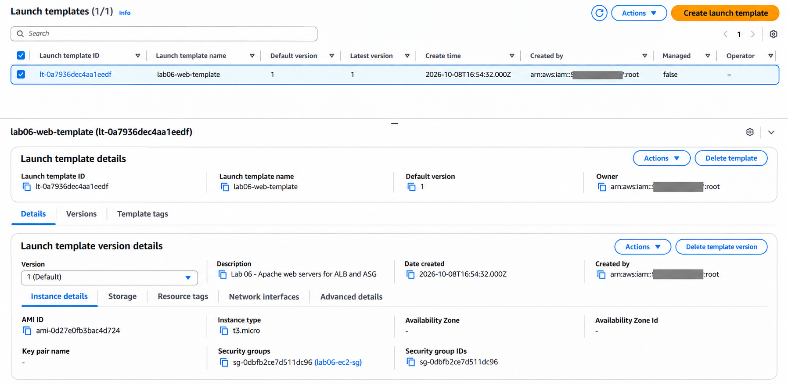

---

### 5. Target Group Configuration

A Target Group was created to register the EC2 instances and monitor application health.

**Target Group:** `lab06-web-tg`

**Configuration:**

| Setting | Value |
|---|---|
| Target Type | Instances |
| Protocol | HTTP |
| Port | 80 |
| Health Check Protocol | HTTP |
| Health Check Path | / |

The Target Group performs health checks to determine whether registered instances are available to receive traffic.

**Evidence:**

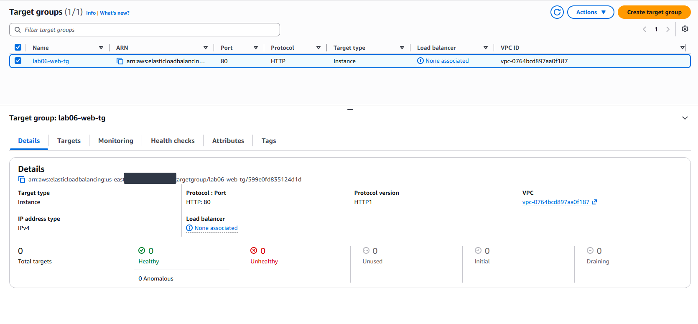

---

### 6. Target Group Health Checks

After correcting the EC2 initialization configuration and refreshing the instances, the Target Group reported two healthy targets.

**Validation results:**

- Healthy targets: 2
- Unhealthy targets: 0
- Health check endpoint: `/`

This confirmed that both Apache web servers were responding successfully to the configured health checks.

**Evidence:**

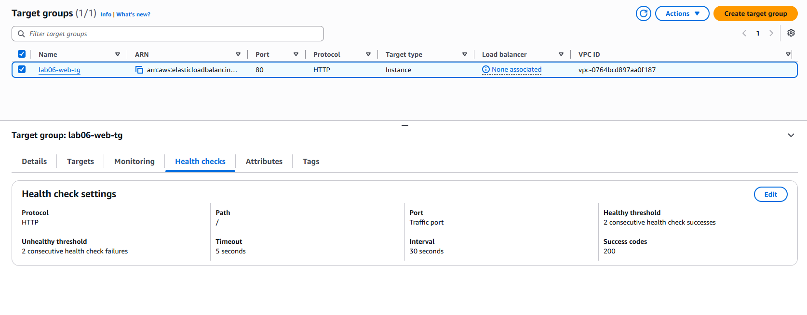

---

### 7. Application Load Balancer

An internet-facing Application Load Balancer was deployed to receive and distribute HTTP traffic.

**Load Balancer:** `lab06-web-alb`

**Configuration:**

- Type: Application Load Balancer
- Scheme: Internet-facing
- IP address type: IPv4
- Availability Zones: `us-east-1a` and `us-east-1b`
- Security Group: `lab06-alb-sg`

The ALB provides a single public endpoint for accessing the application.

**Evidence:**

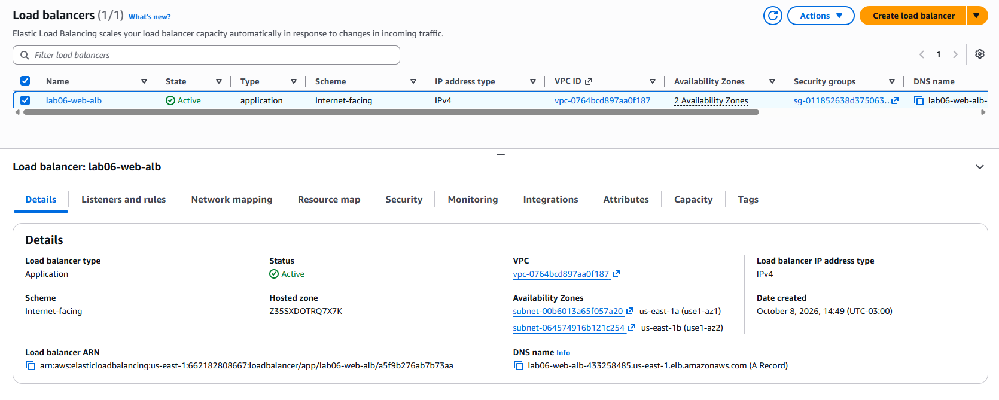

---

### 8. ALB Listener Configuration

An HTTP listener was configured to forward incoming requests to the Target Group.

**Listener configuration:**

| Setting | Value |
|---|---|
| Protocol | HTTP |
| Port | 80 |
| Default Action | Forward |
| Target Group | lab06-web-tg |

The listener connects the public ALB endpoint to the backend EC2 instances.

**Evidence:**

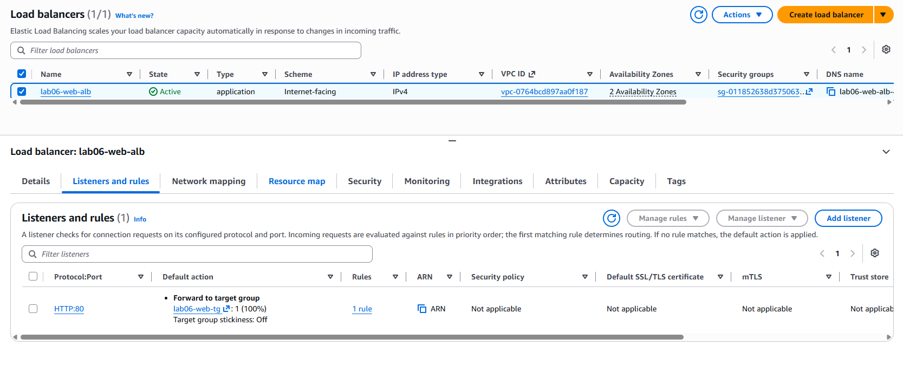

---

### 9. Auto Scaling Group

An Auto Scaling Group was created to manage EC2 instances across two Availability Zones.

**Auto Scaling Group:** `lab06-web-asg`

**Configuration:**

| Setting | Value |
|---|---|
| Launch Template | lab06-web-template |
| Minimum Capacity | 2 |
| Desired Capacity | 2 |
| Maximum Capacity | 4 |
| Health Check Type | ELB |
| Health Check Grace Period | 180 seconds |
| Availability Zones | us-east-1a and us-east-1b |

The Auto Scaling Group maintains the configured desired capacity and can replace unhealthy instances.

**Important:** CPU-based dynamic scaling policies were not configured or tested during this lab.

**Evidence:**

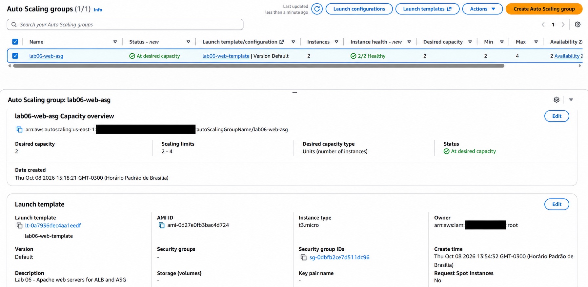

---

### 10. EC2 Instances Managed by Auto Scaling

The Auto Scaling Group provisioned two EC2 instances distributed across separate Availability Zones.

Both instances were configured to run Apache using the Launch Template.

The multi-AZ configuration reduces dependency on a single Availability Zone.

**Evidence:**

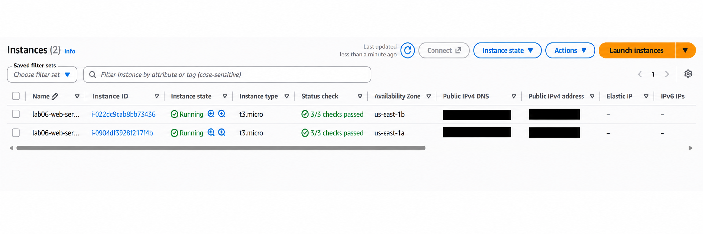

---

## 🔧 Troubleshooting and Instance Refresh

During the initial deployment, the EC2 instances did not successfully serve the expected web application.

The issue was associated with the initial User Data configuration.

### Troubleshooting Process

1. Identified that the application was not responding as expected.
2. Reviewed the EC2 initialization configuration.
3. Corrected the User Data configuration.
4. Created version 2 of the Launch Template.
5. Initiated an Instance Refresh in the Auto Scaling Group.
6. Monitored the replacement process.
7. Validated the health of the new EC2 instances.

### Instance Refresh Results

| Metric | Result |
|---|---|
| Refresh Status | Successful |
| Progress | 100% |
| Instances Remaining to Update | 0 |
| Healthy Instances | 2 of 2 |

The Instance Refresh successfully replaced the previous instances with new instances using the updated Launch Template configuration.

**Evidence:**

---

## 🧪 Validation and Testing

### HTTP Connectivity Test

The web application was accessed successfully through the Application Load Balancer DNS endpoint.

Multiple HTTP requests were performed using PowerShell to verify application connectivity.

**Observed result:**

`HTTP 200 OK`

The successful responses confirmed that the Application Load Balancer could forward HTTP traffic to healthy EC2 targets.

### Health Check Validation

The Target Group reported both registered instances as healthy after the configuration update.

### Instance Replacement Validation

The Instance Refresh completed successfully, demonstrating the replacement of instances using an updated Launch Template version.

---

## 📚 Key Learnings

This lab provided practical experience with:

- Designing a multi-AZ web application infrastructure
- Understanding the relationship between ALB, Target Groups, and Auto Scaling Groups
- Configuring Security Groups for controlled application access
- Standardizing EC2 provisioning using Launch Templates
- Automating Apache installation with User Data
- Configuring and interpreting HTTP health checks
- Troubleshooting EC2 initialization failures
- Updating Launch Template versions
- Performing an Instance Refresh
- Validating application connectivity through HTTP requests
- Understanding how Auto Scaling maintains desired capacity

---

## 🧹 Resource Cleanup

After completing the lab, the following resources were removed to avoid unnecessary AWS charges:

- Auto Scaling Group
- Application Load Balancer
- Target Group
- Launch Template
- EC2 instances

Additional checks were performed for EBS volumes, snapshots, and Elastic IPs.

The shared VPC and networking resources were preserved for future laboratories.

---

## ✅ Conclusion

This lab demonstrated how to deploy and validate a highly available web application infrastructure using AWS Application Load Balancer and Amazon EC2 Auto Scaling.

The implementation covered multi-AZ deployment, secure traffic routing, automated instance provisioning, application health monitoring, and instance replacement using Instance Refresh.

The troubleshooting process also provided practical experience identifying and correcting configuration issues in an AWS environment.

**Lab Status: Completed**
