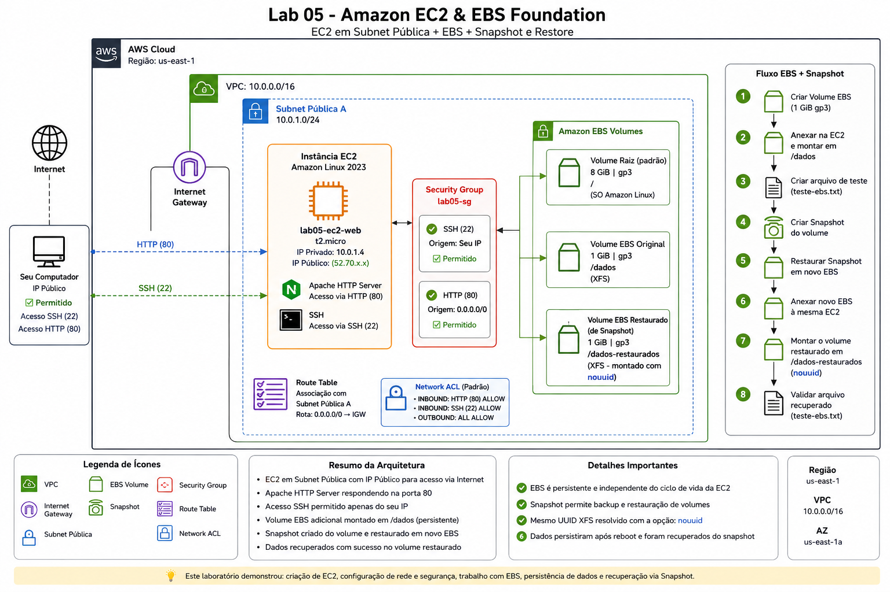
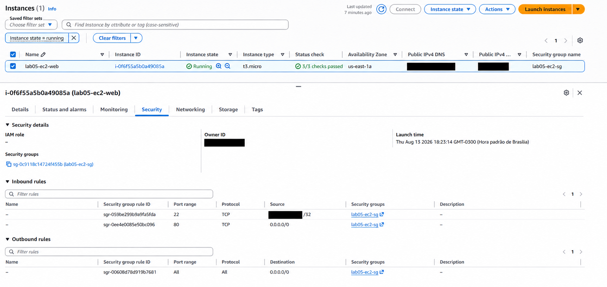
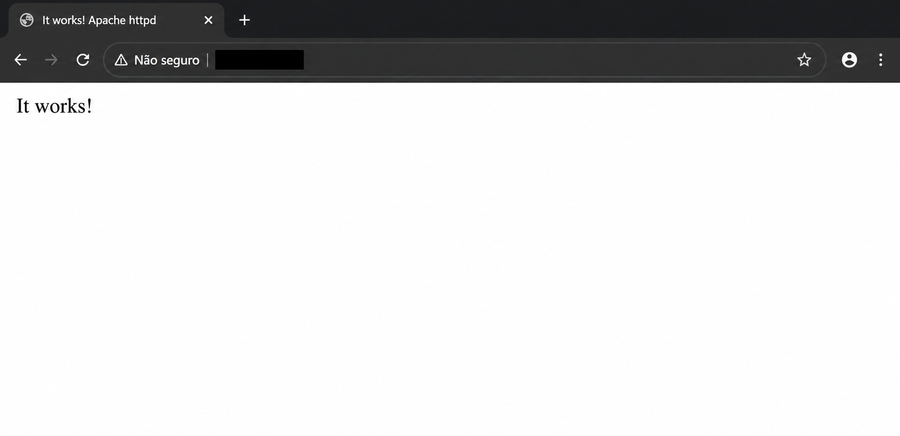
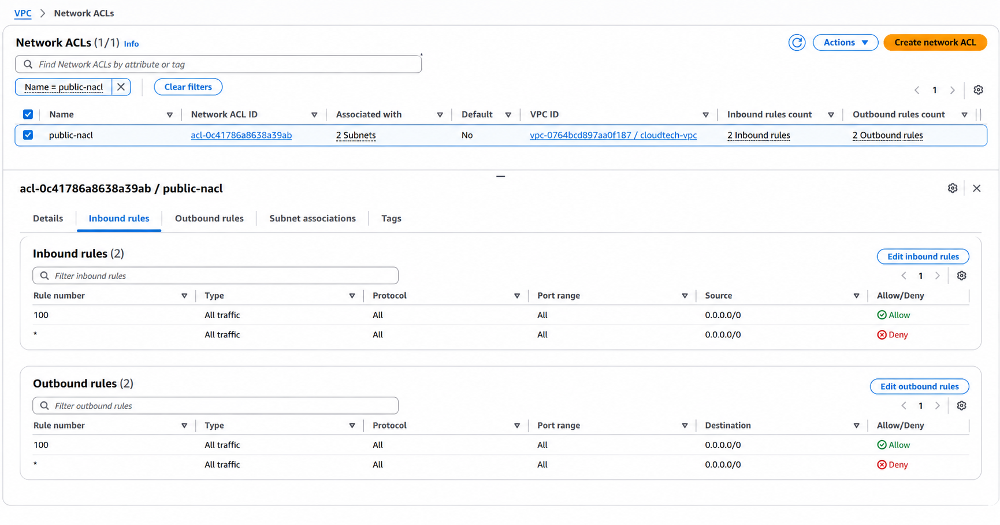
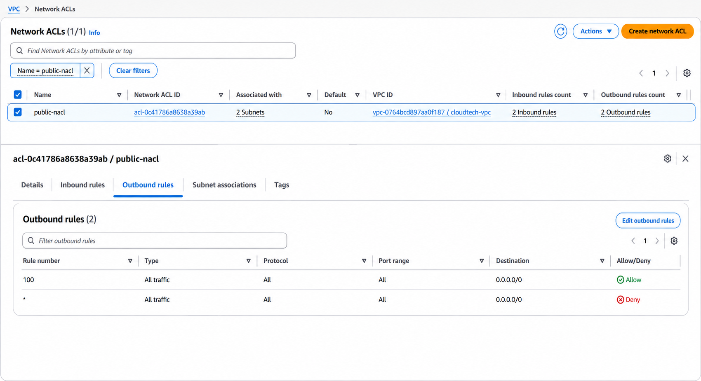
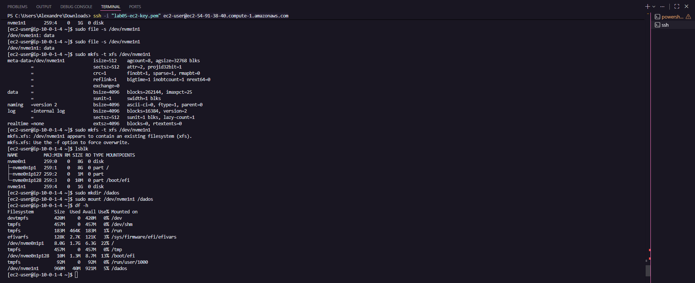
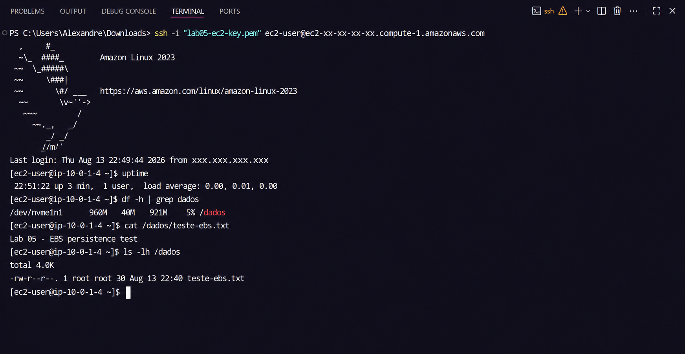
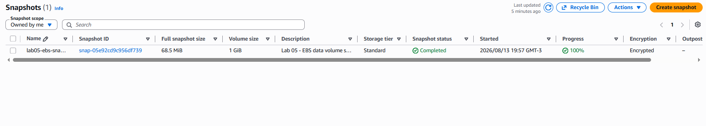
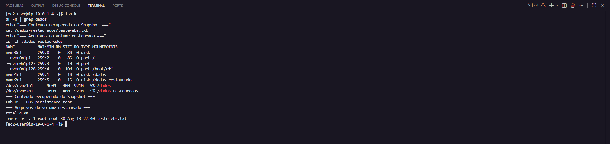

# 🖥️ Lab 05 - Amazon EC2 & EBS

## 📌 Overview

This lab demonstrates the deployment and configuration of an Amazon EC2 instance integrated with Amazon EBS storage.

The environment was built inside the VPC created in the previous networking lab, using a public subnet with internet access.

During the lab, an Amazon Linux 2023 EC2 instance was launched, a web server was deployed, SSH connectivity was tested, and an additional EBS volume was created, attached, formatted, mounted, and configured for persistent mounting.

The lab also demonstrates data protection and recovery using EBS Snapshots by restoring a snapshot into a new EBS volume and validating the recovered data.

---

## 🎯 Objectives

- Launch and configure an Amazon EC2 instance
- Understand EC2 networking and security
- Configure Security Group rules
- Validate Network ACL behavior
- Deploy an Apache web server
- Connect to the instance using SSH
- Understand EC2 instance storage
- Create and attach an additional EBS volume
- Format and mount an EBS volume
- Configure persistent mounting using `/etc/fstab`
- Validate EBS persistence after an EC2 reboot
- Create an EBS Snapshot
- Restore a new EBS volume from the snapshot
- Validate data recovery from the restored volume

---

## 🏗️ Architecture



The architecture consists of:

- Amazon VPC
- Public Subnet
- Internet Gateway
- Route Table
- Network ACL
- Security Group
- Amazon EC2
- Amazon EBS root volume
- Additional Amazon EBS data volume
- EBS Snapshot
- Restored EBS volume

---

## ⚙️ EC2 Instance

An Amazon EC2 instance was launched using:

| Configuration | Value |
|---|---|
| Operating System | Amazon Linux 2023 |
| Instance Type | t3.micro |
| Network | Existing VPC |
| Subnet | Public Subnet |
| Public IPv4 | Enabled |
| Root Volume | 8 GiB gp3 |
| Web Server | Apache HTTP Server |

The instance was successfully launched and passed all EC2 status checks.

---

## 🔐 Security Group

A dedicated Security Group was configured for the EC2 instance.

### Inbound Rules

| Protocol | Port | Source | Purpose |
|---|---:|---|---|
| SSH | 22 | My IP | Remote administration |
| HTTP | 80 | 0.0.0.0/0 | Public web access |

SSH access was restricted to the administrator's public IP address instead of being exposed to the entire internet.

HTTP access was allowed publicly so the Apache web server could be accessed through the instance's public IPv4 address.

---

## 🌐 Network ACL

During the deployment, the Apache server initially could not be accessed from the internet even though:

- The EC2 instance was running
- The Security Group allowed HTTP traffic
- The instance had a public IPv4 address
- Apache was installed and running

The issue was identified in the Network ACL associated with the public subnet.

After correcting the Network ACL rules, communication was successfully established.

This troubleshooting demonstrated an important difference between Security Groups and Network ACLs:

- **Security Groups are stateful**
- **Network ACLs are stateless**

Both layers must allow the required traffic for communication to succeed.

---

## 🌍 Apache Web Server

Apache HTTP Server was installed and executed on the EC2 instance.

The web server was successfully accessed through the EC2 public IPv4 address, confirming that the following components were working correctly:

```text
Internet
   ↓
Internet Gateway
   ↓
Route Table
   ↓
Network ACL
   ↓
Security Group
   ↓
EC2
   ↓
Apache HTTP Server
```

The browser successfully displayed the Apache test page.

---

## 💻 SSH Access

Remote administration was performed using SSH with the private key generated for the EC2 instance.

The connection was established using the `ec2-user` account.

After connecting, basic commands were used to validate the instance environment:

```bash
hostname
hostname -I
whoami
lsblk
```

This confirmed the instance hostname, private IP address, connected user, and available block storage devices.

> The private `.pem` key used to access the instance is not stored in this repository.

---

## 💾 Amazon EBS

The EC2 instance initially contained an 8 GiB gp3 root EBS volume.

An additional **1 GiB gp3 EBS volume** was created in the same Availability Zone as the EC2 instance.

The additional volume was then attached to the instance.

After attachment, the operating system detected the new block device.

```bash
lsblk
```

The additional volume appeared as:

```text
nvme1n1    1G    disk
```

---

## 🗂️ Formatting and Mounting the EBS Volume

The new EBS volume did not initially contain a filesystem.

An XFS filesystem was created:

```bash
sudo mkfs -t xfs /dev/nvme1n1
```

A mount directory was created:

```bash
sudo mkdir /dados
```

The volume was mounted:

```bash
sudo mount /dev/nvme1n1 /dados
```

The mount was validated with:

```bash
df -h
```

The additional EBS volume was successfully available through:

```text
/dados
```

---

## 🔄 Persistent EBS Mount

By default, a manually mounted volume does not automatically remount after an instance reboot.

The volume UUID was identified using:

```bash
sudo blkid /dev/nvme1n1
```

The `/etc/fstab` configuration was then updated to automatically mount the volume at `/dados` during system startup.

The configuration was validated by unmounting and remounting the filesystems:

```bash
sudo umount /dados
sudo mount -a
```

The volume was successfully mounted again.

---

## 🧪 EBS Persistence Test

A test file was created inside the additional EBS volume:

```bash
echo "Lab 05 - EBS persistence test" | sudo tee /dados/teste-ebs.txt
```

The content was validated:

```bash
cat /dados/teste-ebs.txt
```

The EC2 instance was then rebooted.

After reconnecting through SSH, the following validations were performed:

```bash
df -h | grep dados
cat /dados/teste-ebs.txt
ls -lh /dados
```

The volume was automatically mounted and the test file remained available.

This confirmed that:

- EBS data persisted after the EC2 reboot
- `/etc/fstab` successfully mounted the volume automatically
- The filesystem remained intact

---

## 📸 EBS Snapshot

An EBS Snapshot was created from the additional data volume.

The snapshot completed successfully and was stored using encryption.

The snapshot represents a point-in-time backup of the EBS volume and can be used to create new volumes for backup, recovery, or migration scenarios.

---

## ♻️ Restoring an EBS Snapshot

A new EBS volume was created from the previously generated snapshot.

The restored volume was attached to the same EC2 instance.

After attachment, the operating system detected both volumes:

```text
Original EBS Volume  → /dados
Restored EBS Volume  → /dados-restaurados
```

Because the restored volume originated from an XFS snapshot, it contained the same filesystem UUID as the original volume.

Attempting to mount both XFS filesystems simultaneously initially generated a filesystem error.

The restored volume was therefore mounted using:

```bash
sudo mount -o nouuid /dev/nvme2n1 /dados-restaurados
```

This allowed both the original and restored XFS volumes to coexist on the same EC2 instance.

---

## ✅ Data Recovery Validation

The recovered data was validated using:

```bash
cat /dados-restaurados/teste-ebs.txt
```

The original content was successfully recovered:

```text
Lab 05 - EBS persistence test
```

The restored volume was also validated using:

```bash
ls -lh /dados-restaurados
```

This confirmed the complete recovery flow:

```text
EBS Volume
    ↓
Data
    ↓
EBS Snapshot
    ↓
New EBS Volume
    ↓
Attach to EC2
    ↓
Mount restored filesystem
    ↓
Recovered Data
```

---

## 📷 Evidence

### 01 - EC2 Instance and Security Group



Shows the running EC2 instance and the Security Group configuration used for HTTP and SSH access.

### 02 - Apache Web Server



Confirms successful public access to the Apache HTTP Server running on the EC2 instance.

### 03 - Network ACL Inbound Rules



Shows the inbound Network ACL configuration associated with the public subnets.

### 04 - Network ACL Outbound Rules



Shows the outbound Network ACL configuration required for network communication.

### 05 - EBS Volume Mounted



Demonstrates the additional EBS volume formatted with XFS and mounted at `/dados`.

### 06 - EBS Persistence After Reboot



Confirms that the EBS volume was automatically remounted and the stored data remained available after rebooting the EC2 instance.

### 07 - EBS Snapshot Completed



Shows the successfully completed snapshot of the EBS data volume.

### 08 - EBS Snapshot Restore



Confirms that the restored EBS volume was mounted and the original test data was successfully recovered from the snapshot.

---

## 🧠 Key Learnings

This lab provided hands-on experience with several important EC2 and EBS concepts:

- EC2 instances depend on multiple networking components to communicate with the internet
- Security Groups and Network ACLs operate at different layers
- Security Groups are stateful while Network ACLs are stateless
- SSH private keys must be protected and never committed to public repositories
- EBS volumes are independent block storage resources
- EBS volumes must exist in the same Availability Zone as the EC2 instance to be attached
- New EBS volumes must be formatted before being mounted
- `/etc/fstab` can be used to persist mounts across reboots
- EBS data persists independently of an operating system reboot
- EBS Snapshots provide point-in-time backups
- Snapshots can be restored into new EBS volumes
- Restored XFS volumes can retain the same filesystem UUID
- The `nouuid` option allows cloned XFS filesystems to be mounted simultaneously

---

## 🏁 Conclusion

This lab demonstrated the complete lifecycle of a basic Amazon EC2 workload with persistent Amazon EBS storage.

Beyond simply launching an EC2 instance, the lab covered networking troubleshooting, secure remote access, web server deployment, block storage management, persistent filesystem configuration, backup creation, and data recovery.

The snapshot restore test demonstrated an important real-world recovery scenario: data stored on an EBS volume can be backed up and successfully restored into a new volume when needed.
